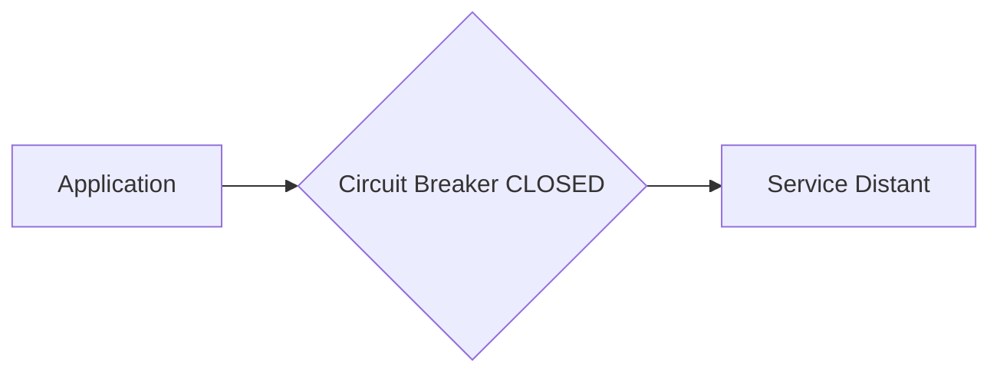
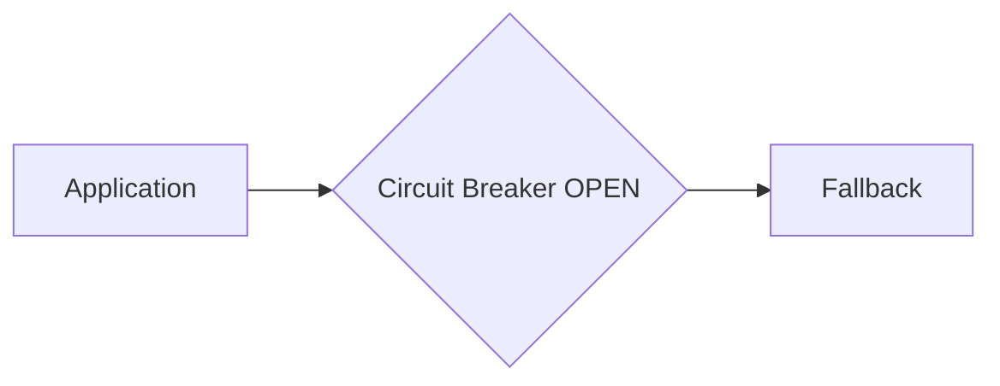

***This is a subtitle***

**Author:** *ME!*
---
# état `CLOSED`


```mermaid
flowchart LR
    A[Application] --> B{Circuit Breaker CLOSED} --> C[Service Distant]

```

# état `OPEN`


```mermaid
flowchart LR
    A[Application] --> B{Circuit Breaker OPEN} --> C[Fallback]

```

# état `HALF_OPEN`

```mermaid

```

